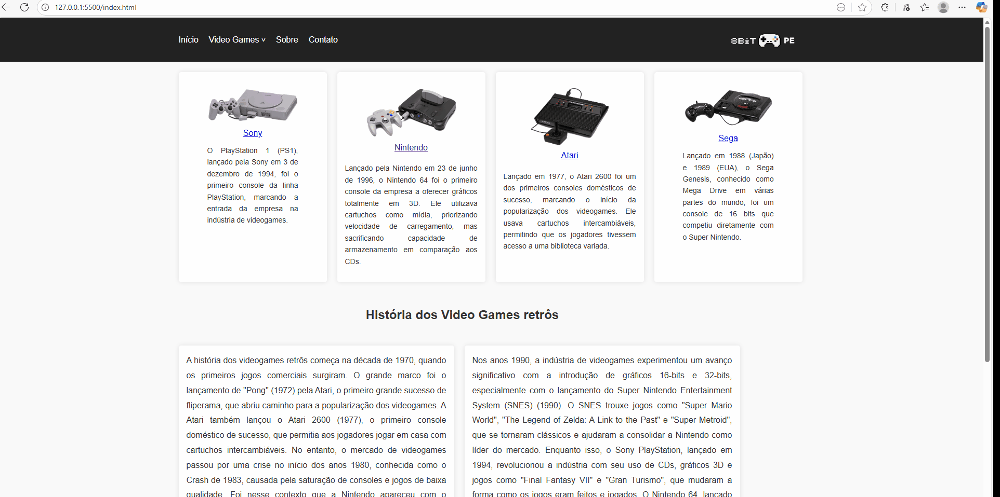

# 🚀 ATIVIDADE3CICLODAVIDB

## 📌 Introdução  
- **Descrição:** O projeto "8bitPe" é um site interativo que explora a história dos videogames retrôs, destacando consoles icônicos como Atari, Nintendo, Sega e Sony PlayStation.
- **Contexto:** Desenvolvido como parte das atividades acadêmicas do curso de Análise e Desenvolvimento de Sistemas.
- **Objetivo:** Apresentar a evolução dos consoles de videogame retrô e proporcionar uma navegação interativa sobre esses sistemas históricos.
- **Motivação:** A motivação para o desenvolvimento foi criar uma plataforma de fácil acesso que compartilhasse a rica história dos videogames.

## ✨ Principais Funcionalidades  
- 📌 **Menu Interativo:** Navegação prática com submenus para explorar diferentes consoles.
- 📌 **Design Responsivo:** O layout se adapta a diferentes dispositivos, proporcionando uma experiência otimizada.
- 📌 **Conteúdo Rico:** Inclui imagens e descrições detalhadas sobre cada console, enriquecendo a experiência do usuário.

## 🛠️ Tecnologias Utilizadas  
- **Linguagens de Programação:**  
  - 🚀 `HTML5` - Usado para estruturar o conteúdo da página.  
  - 🚀 `CSS3` - Responsável pela estilização e design responsivo da página.

-----

## 📷 Demonstração

-----

## 🎯 Lições Aprendidas  
- 💡 **Desafio enfrentado:** Desenvolver um design responsivo para múltiplos dispositivos.
- 💡 **Habilidade desenvolvida:** Melhor compreensão de design web e uso de HTML5 e CSS3.
- 💡 **Trabalho em equipe (se aplicável):** O projeto foi desenvolvido de forma individual, permitindo o aprendizado autônomo.

## 🎉 Conclusão  
Este projeto foi uma ótima oportunidade para aplicar conhecimentos sobre desenvolvimento web e criar uma interface que celebra a história dos videogames retrôs.

